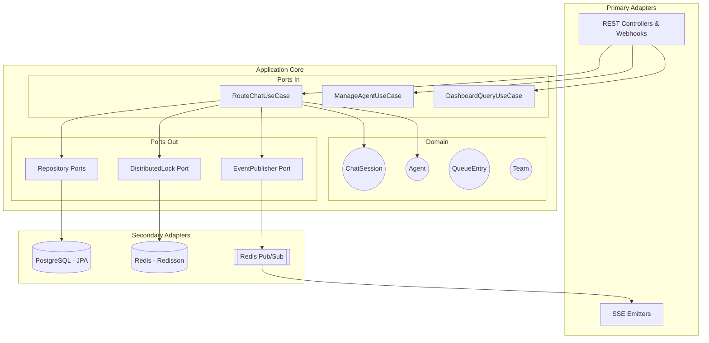
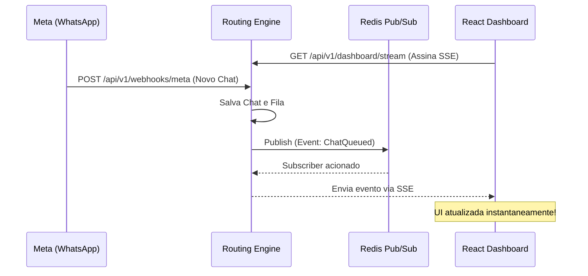

# Architecture Document - FlowPay

Este documento descreve as diretrizes arquiteturais adotadas para o desenvolvimento do FlowPay, garantindo manutenibilidade, testabilidade e alta escalabilidade.

## 1. Hexagonal Architecture (Ports and Adapters)

O sistema foi estruturado seguindo os preceitos da Arquitetura Hexagonal (Clean Architecture), cujo objetivo principal é isolar a lógica de negócios (Domínio) das preocupações de infraestrutura (Bancos de dados, Frameworks, APIs externas).

### Regras de Isolamento:
1.  **Domínio:** Sem anotações do framework (`@Entity`, `@Component`, etc). Somente Java puro.
2.  **Aplicação (Services):** Depende do Domínio e das interfaces de Porta. Orquestra a execução.
3.  **Adaptadores:** Implementam as portas (ex: JPA repositories). Conhecem o Spring, mas o Core não os conhece.

## 2. Padrão de Alta Concorrência (Lock Híbrido)

O FlowPay processa mensagens de chat simultâneas. Para evitar condições de corrida (Race Conditions), adotamos três níveis de proteção de concorrência:

1.  **Macro (Orquestração):** `Redisson Distributed Lock` garante que, para um determinado time (ex: `flowpay:lock:routing:team:123`), apenas um *Thread/Pod* rode a roleta de distribuição por vez.
2.  **Fila (Throughput):** `SELECT ... FOR UPDATE SKIP LOCKED` nativo do PostgreSQL. Isso permite que vários consumidores olhem para a tabela `queue_entries` sem ficarem travados na mesma linha, aumentando drasticamente o throughput.
3.  **Micro (Atribuição):** `PESSIMISTIC_WRITE` no repositório de agentes garante que a validação de limite de chats (`max_chats`) seja atômica, travando a linha no banco apenas pelos poucos milissegundos do cálculo.

## 3. Comunicação em Tempo Real (SSE e Pub/Sub)

Para atualizar o frontend reativamente sem sobrecarregar o backend com requisições *Long-Polling* e evitando o peso de uma infraestrutura *WebSocket* completa:

Esta arquitetura minimiza o uso de conexões de banco de dados e aproveita o Redis como um *Event Bus* de altíssima performance.
